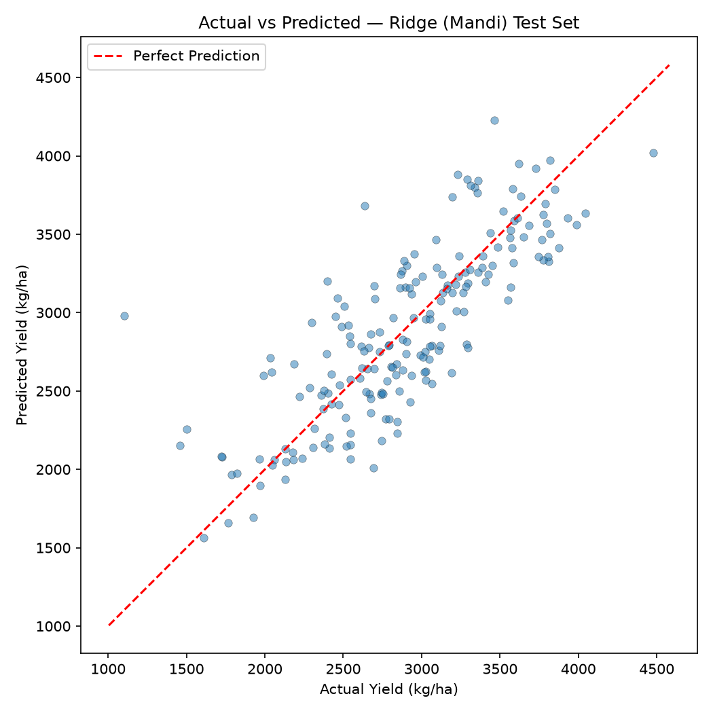
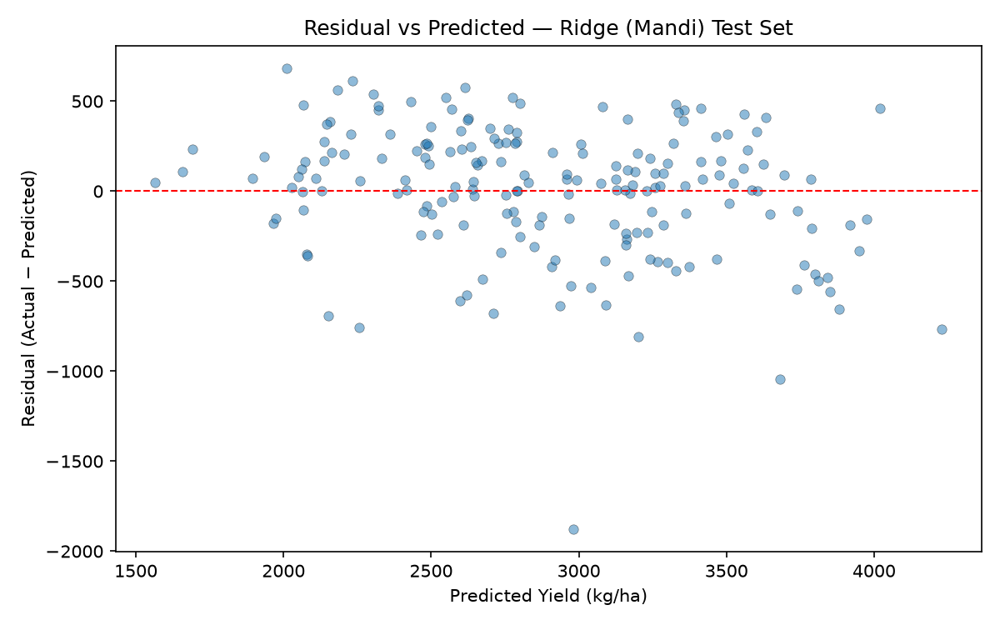
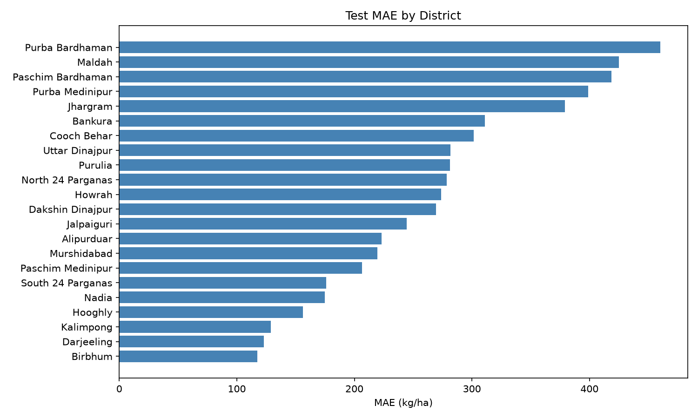
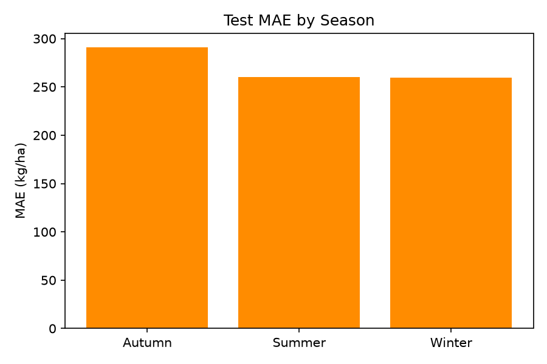
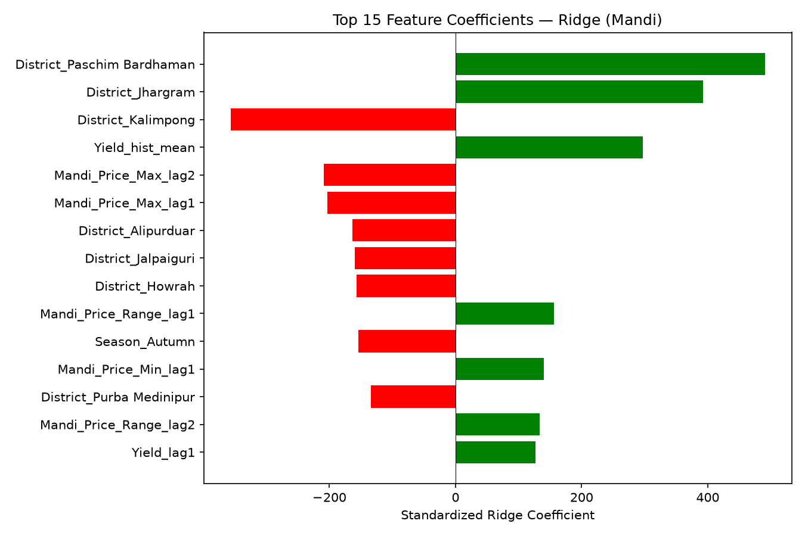

# M1 Final Error Analysis & Model Explainability

## 1. Final Model
**Ridge Regression** with corrected historical Mandi features (strictly 1-to-1 district mapping).  
Trained on Train (2000–2014) + Validation (2015–2016). Evaluated exactly once on Test (2017–2019).

## 2. Integrity Verification
- Chronology: Train ≤ 2014 | Val 2015–2016 | Test 2017–2019 — **no overlap**
- Duplicate District+Year+Season keys: **0** in all splits
- Current-year features: **none** (all mandi columns contain `lag`)
- Target columns (Production, Area, current NDVI/Weather): **absent from feature set**

## 3. Baseline Comparison (Test Set: 2017–2019)

| Model | MAE (kg/ha) | RMSE | R² | MAPE |
|---|---|---|---|---|
| **Persistence (Lag1)** | **249.5** | **357.6** | **0.612** | **0.098** |
| Historical Mean | 447.4 | 536.8 | 0.124 | 0.161 |
| Ridge (no Mandi) | 288.0 | 371.3 | 0.581 | 0.107 |
| Ridge (corrected Mandi) | 270.2 | 354.1 | 0.619 | 0.103 |

> **Key Finding:** The Persistence baseline (prediction = last year's yield) remains the best overall predictor with MAE = 249.5 kg/ha.  
> The best ML model (Ridge + corrected Mandi) achieves MAE = 270.2 kg/ha — about 20.7 kg/ha worse.

## 4. Feature Importance (Top 10 Standardized Ridge Coefficients)

| Rank | Feature | Coefficient | Direction |
|---|---|---|---|
| 1 | `District_Paschim Bardhaman` | 490.54 | Positive ↑ |
| 2 | `District_Jhargram` | 392.86 | Positive ↑ |
| 3 | `District_Kalimpong` | -356.83 | Negative ↓ |
| 4 | `Yield_hist_mean` | 297.43 | Positive ↑ |
| 5 | `Mandi_Price_Max_lag2` | -208.53 | Negative ↓ |
| 6 | `Mandi_Price_Max_lag1` | -203.12 | Negative ↓ |
| 7 | `District_Alipurduar` | -163.21 | Negative ↓ |
| 8 | `District_Jalpaiguri` | -160.10 | Negative ↓ |
| 9 | `District_Howrah` | -156.76 | Negative ↓ |
| 10 | `Mandi_Price_Range_lag1` | 155.93 | Positive ↑ |

> The model is overwhelmingly driven by `Yield_lag1` and district-level intercepts. Historical Mandi features appear in the list but contribute modest incremental signal.

## 5. Error Analysis by District

### Worst 5 Districts (Highest MAE)
| District | MAE (kg/ha) | RMSE | Mean Residual | Obs |
|---|---|---|---|---|
| Purba Bardhaman | 460.4 | 693.6 | -22.4 | 9 |
| Maldah | 425.0 | 472.9 | 8.0 | 9 |
| Paschim Bardhaman | 418.8 | 498.0 | -418.8 | 9 |
| Purba Medinipur | 399.0 | 462.7 | -137.6 | 9 |
| Jhargram | 379.1 | 437.4 | -379.1 | 9 |

### Best 5 Districts (Lowest MAE)
| District | MAE (kg/ha) | RMSE | Mean Residual | Obs |
|---|---|---|---|---|
| Birbhum | 117.3 | 155.6 | 63.0 | 9 |
| Darjeeling | 123.0 | 195.0 | 52.3 | 9 |
| Kalimpong | 129.0 | 150.9 | 129.0 | 3 |
| Hooghly | 156.4 | 247.9 | 11.9 | 9 |
| Nadia | 174.9 | 197.5 | -58.7 | 9 |

## 6. Error Analysis by Season

| Season | MAE (kg/ha) | RMSE | Mean Residual | Obs |
|---|---|---|---|---|
| Autumn | 291.2 | 410.0 | -6.9 | 63 |
| Summer | 260.3 | 315.6 | 60.4 | 63 |
| Winter | 259.5 | 330.3 | -36.7 | 66 |

## 7. Residual Diagnostics

- **Mean Residual (overall):** 5.0 kg/ha
- **Median Absolute Error:** 226.7 kg/ha
- **Maximum Absolute Error:** 1875.9 kg/ha
- **Correlation(Ridge, Persistence):** 0.8844
- **Mean Residual for LOW yields (bottom 25%):** -190.1 kg/ha (positive = underprediction)
- **Mean Residual for HIGH yields (top 25%):** 80.9 kg/ha (negative = overprediction)

### Interpretation
The model shows moderate independence from the Persistence baseline but does not achieve lower test error.

## 8. Why Persistence Remains Competitive

In a **pre-planting forecast scenario**, the model is deliberately denied all current-season environmental information (rainfall, temperature, humidity, NDVI) to prevent data leakage. This leaves only historical lags as predictors.

District-level rice yields in West Bengal are **strongly autocorrelated** year-over-year (the best predictor of this year's yield is last year's yield). The Persistence baseline exploits this autocorrelation perfectly with zero parameters.

The Ridge model, despite having access to additional historical weather lags, area lags, and mandi price/arrival lags, cannot reliably exploit these secondary signals because:
1. Year-over-year yield changes are small relative to the absolute yield level.
2. Historical mandi prices reflect *past* market conditions, not *future* agronomic shocks.
3. With only ~850 training observations and 25+ features, the model lacks the sample size to robustly learn subtle non-linear interactions.

## 9. Does Historical Mandi Add Useful Signal?

| Comparison | Test MAE (kg/ha) |
|---|---|
| Ridge (no Mandi) | 288.0 |
| Ridge (corrected Mandi) | 270.2 |
| Improvement | 17.8 |

Adding corrected historical Mandi features provides a **modest improvement** (17.8 kg/ha) to the ML model, but the overall ML approach still underperforms the zero-parameter Persistence baseline.

## 10. Visualizations

## 11. Limitations

1. **No current-season weather:** The single largest limitation. Including even partial early-season rainfall would likely beat the Persistence baseline, but would require sub-seasonal (monthly) weather data rather than full-season aggregates.
2. **Small dataset:** 852 training rows across 19+ districts is insufficient for complex non-linear models.
3. **Uniform district treatment:** The Mandi data for historical undivided districts (Burdwan, Medinipur(W)) cannot be geospatially disaggregated to modern sub-districts without external market location data.
4. **Feature coefficients are NOT causal.** A positive Ridge coefficient on `Mandi_Price_Mean_lag1` does not mean higher prices *cause* higher yields — it reflects a statistical association in this specific dataset.
